# Startup Success Prediction System — UML Diagrams

---

## 1. Use Case Diagram

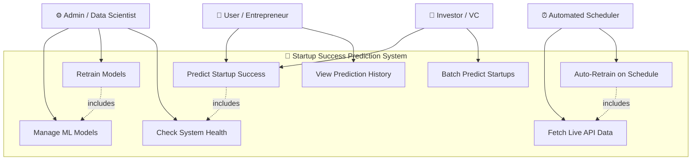

---

## 2. System Architecture Diagram (Component Diagram)

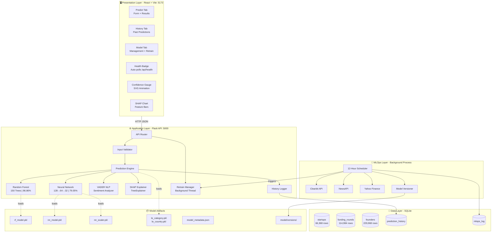

---

## 3. Sequence Diagram — Single Prediction Flow

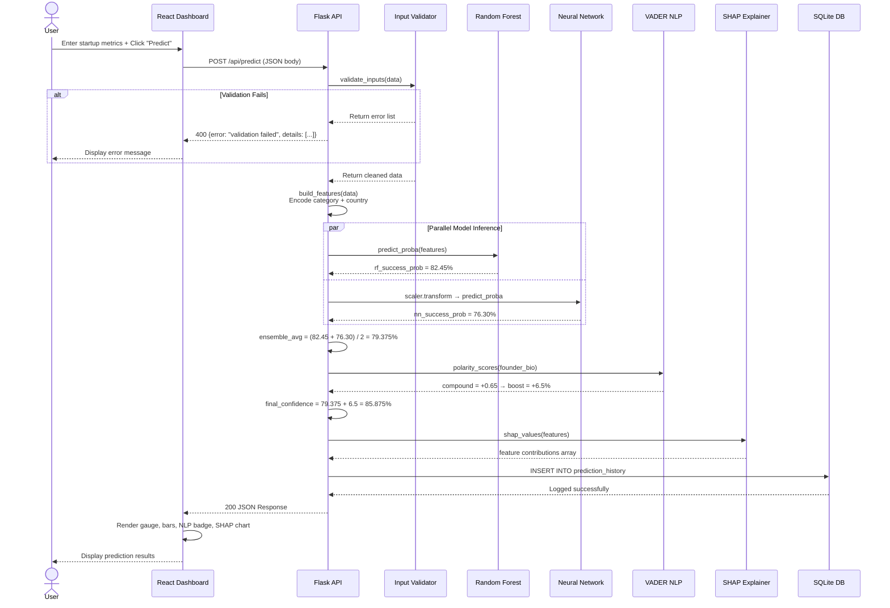

---

## 4. Sequence Diagram — Model Retrain Flow

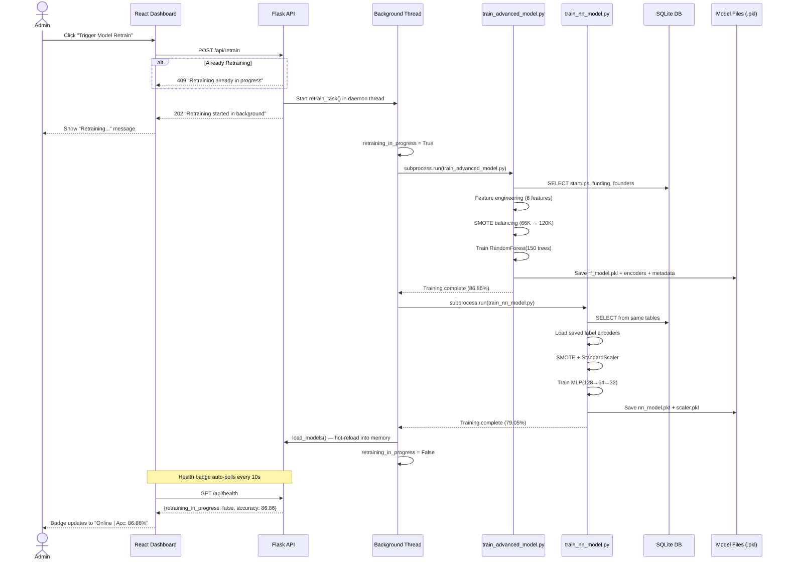

---

## 5. Sequence Diagram — MLOps Pipeline Flow

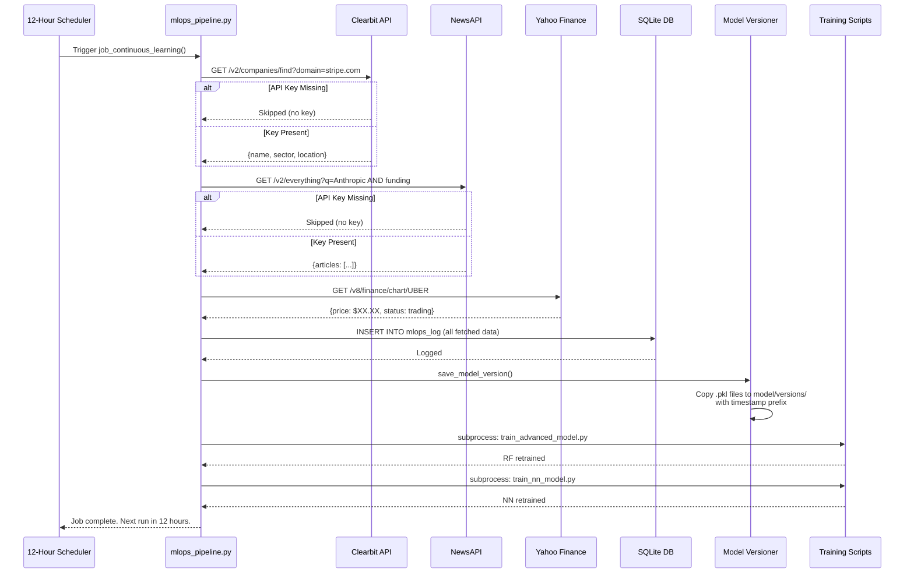

---

## 6. Activity Diagram — Complete Prediction Workflow

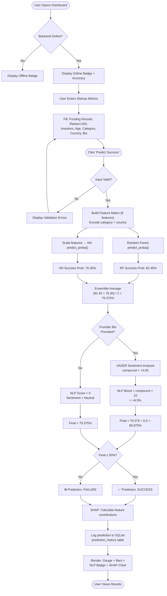

---

## 7. Activity Diagram — ETL Pipeline

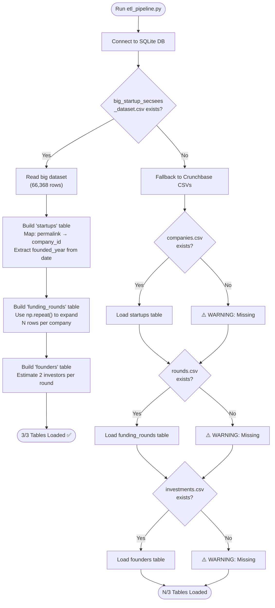

---

## 8. Class Diagram — Backend Structure

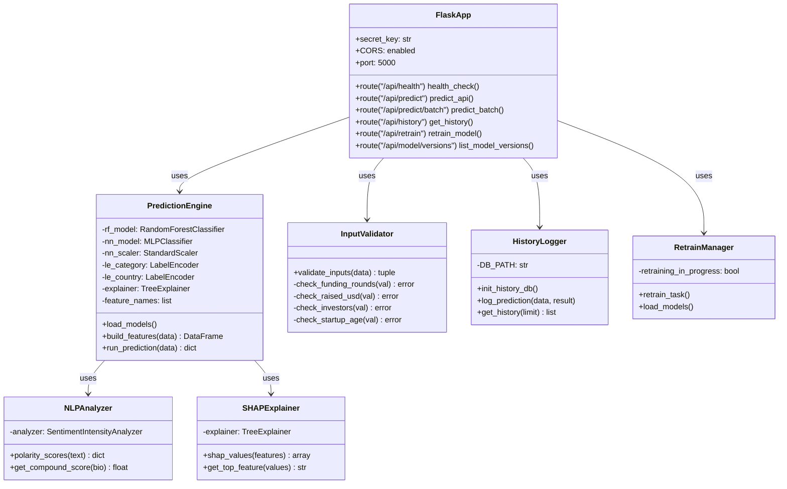

---

## 9. Class Diagram — ML Training Pipeline

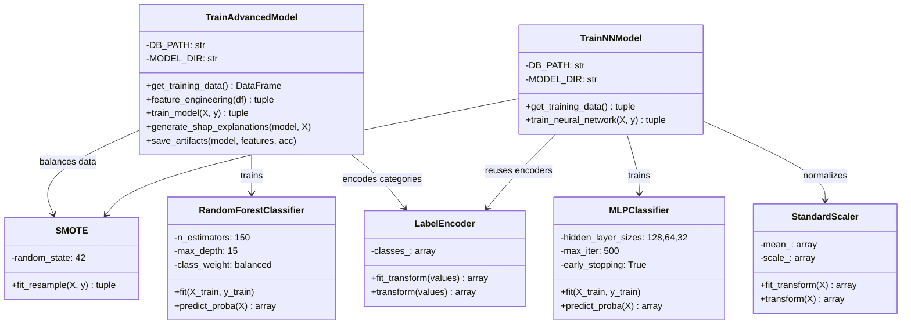

---

## 10. Deployment Diagram

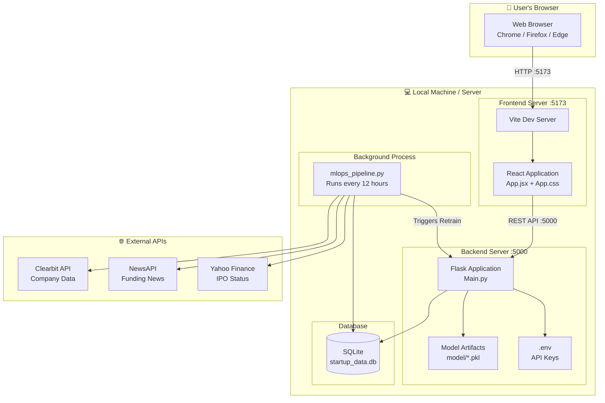

---

## 11. Data Flow Diagram (DFD Level 0)

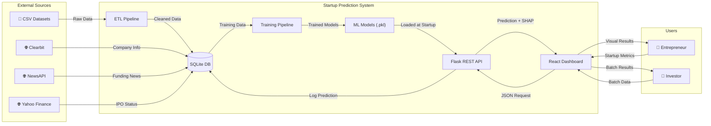

---

## 12. State Diagram — Model Lifecycle

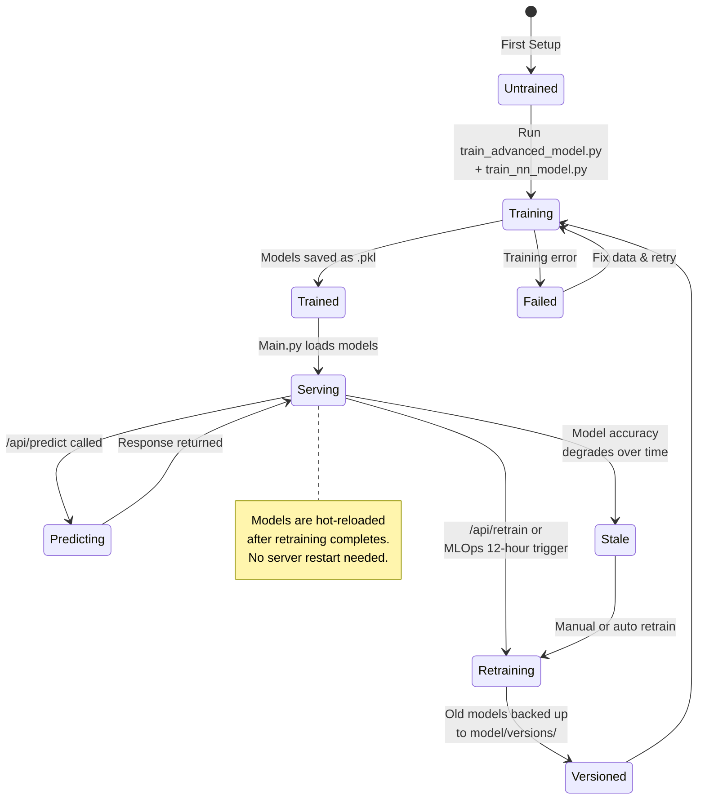

---

> **Note:** All diagrams above use Mermaid syntax. They can be rendered in:
> - GitHub / GitLab (native support)
> - VS Code (with Mermaid extension)
> - Any Mermaid live editor: [mermaid.live](https://mermaid.live)
